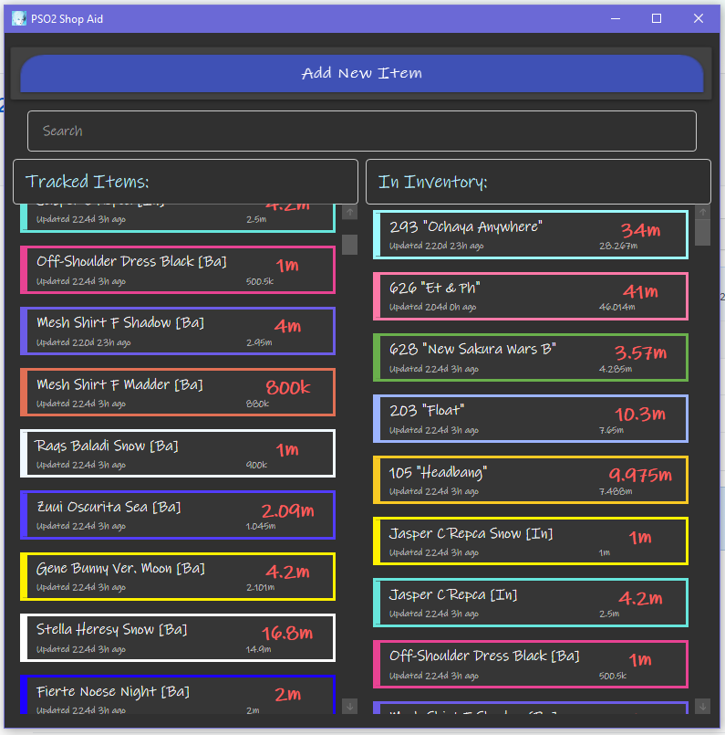
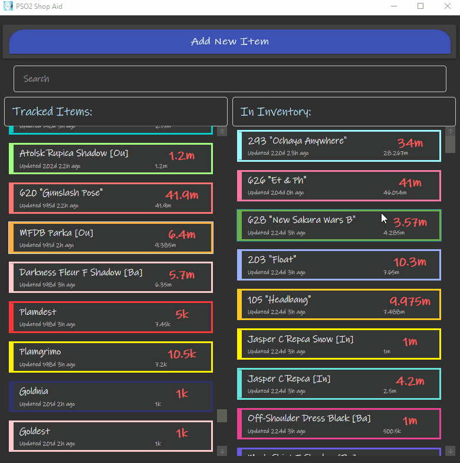
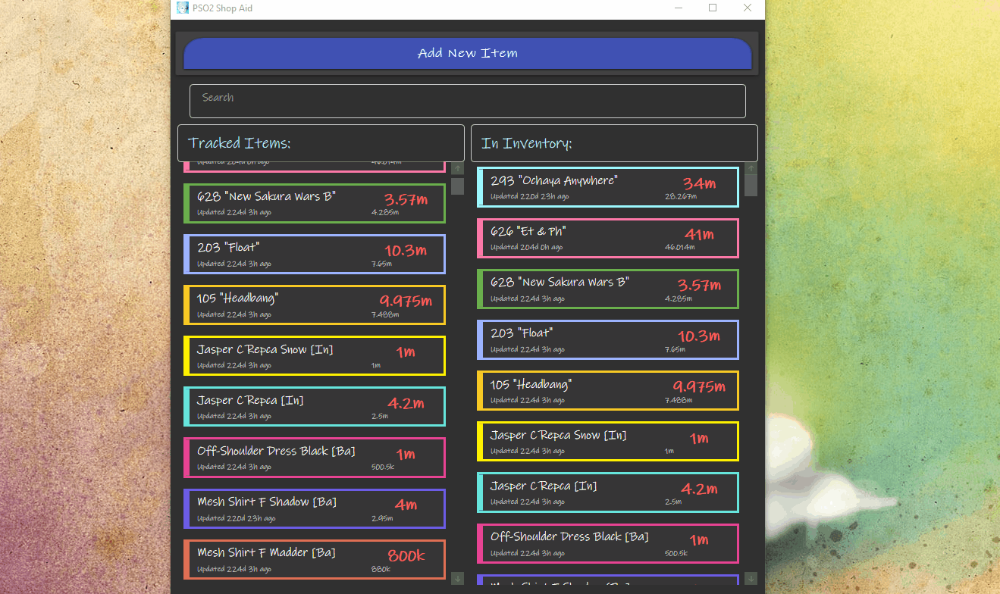
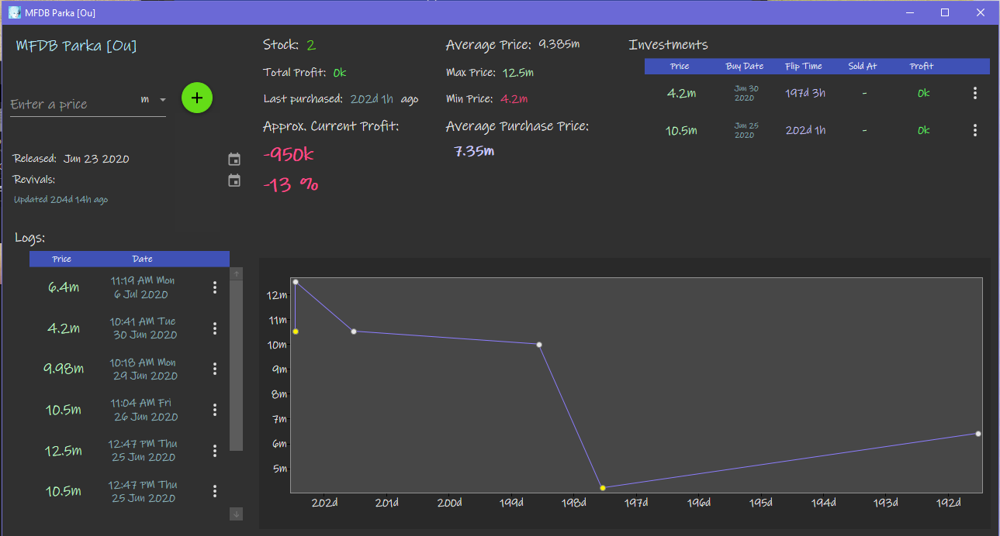

# PSO2ShopAid
Investment Management Helper - PC App

Made with Material Design.  
  
Made to as a personal tool to help with keeping track of Phantasy Star Online 2's player economy ^^  
But it can theoretically be used for any kind of investment!  

## Keep track of interesting items
  
- add items
- delete items
- edit items
- search items
- separates currently-possessed and unpossessed items

## Keep track of an item's economic performance
  
- record an observed price and date
- record purchase price and date
- record sell price and date
- graph records
- calculates investment statistics
- add/delete/edit everything

## Statistics at a glance
 
- average/max/min price
- average purchase price
- approximate profit 
- individual profits and flip time 
